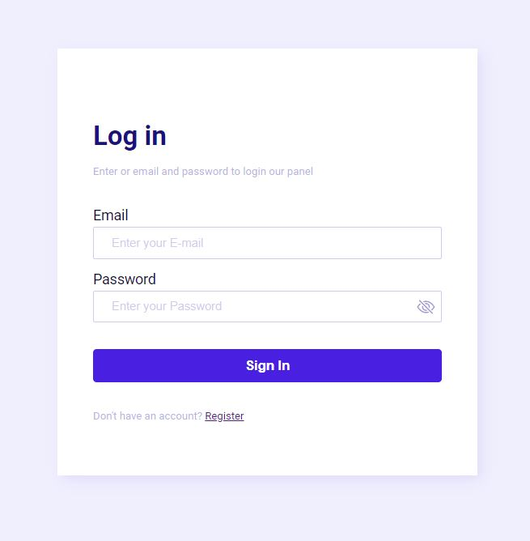

## 📁 Authentication-Security

Em relação a criptgrafia e autenticação foi possível entender melhor sobre:
- Encryption / Decryption: chave é uma vulnerabilidade
- Hash: tabela de hash é uma vulnerabilidade
- Salt: tabela de hash + salt é uma vulnerabilidade
- bcrypt: contém camadas de salt, é mais lento
- Cookies and Sessions
- Passport: middleware para Node.js
- OAuth 2.0: usar Google, Facebook, Github como métodos de login com auth code, acess token

## :rocket: Technologies
- NodeJS
- Express
- Mongoose
- Bcrypt

## Available Scripts
Execute:
### `npm install`

## :camera: Projeto

    

